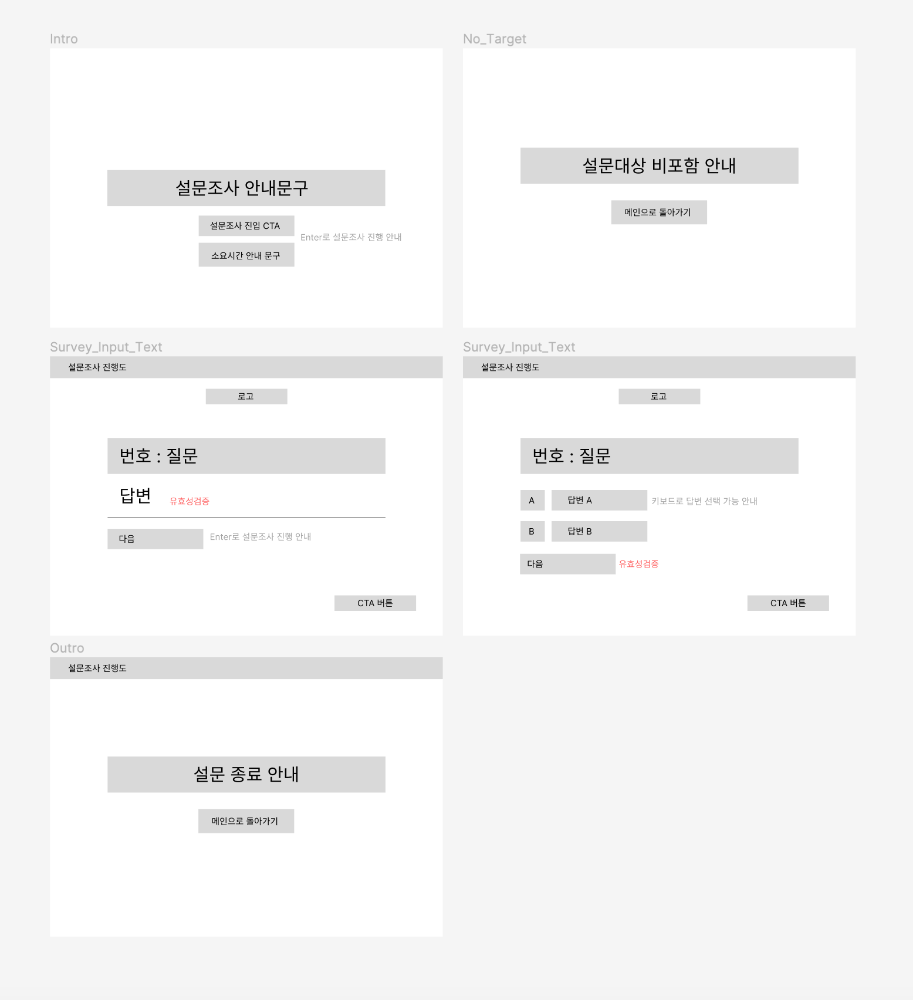

# SurveyPool

## 화면 구성

- [ ] UI는 상단, 중앙, 하단의 레이아웃을 가지고 있다.
- [ ] 상단에는 로고가 위치한다.
- [ ] 하단은 CTA 버튼이 위치한다.
- [ ] 중앙에는 설문 조사 form이 위치하고 input에 자동 focus 된다.
- [ ] 중앙 가장 위에 현재 설문조사 progress 상태를 볼 수 있다. (현재 진행률)

### 화면 예시 디자인

- 다음과 같은 화면 구성을 참고하고, 명시되지 않은 꾸밈요소와 컴포넌트는 자율이다.
  https://pschzwbys8l.typeform.com/to/WkUwovxz

## 기능 구현

### 공통 질문

- [ ] 유저가 입장하면 `/api/question/common`으로 질문지를 받는다.
- [ ] 유저가 대상이 아닌 경우 `/no_target`으로 redirect 시킨다.
- [ ] 유저 답변을 `/api/answers/common`으로 post 요청하고, 다음 질문지 typeID와 userId를 받는다.

### 질문지

- 공통 질문을 통해 얻은 typeID를 이용해 `/api/question/:typeID`에 요청해 질문지를 받는다.
- 질문지는 data.forms에 제시된 순서로 user에게 답변을 받는다.
- 답변을 다 받으면 `/api/answers/:typeID`에 post로 작성한 답변과 userId을 업로드한다.
- nextTypeId가 없으면 `/thanks` 페이지로 이동 후 설문조사를 종료한다.

## 추가 구현

- 한/영 지원
  - 모든 api는 `?lang=en`을 통해 질문을 영어로 받을 수 있다.

## 와이어 프레임

## 브랜치

- feature 브랜치에서 개발 진행
- feature에서 구현 기능 단위로 브랜치를 생성한다.

## 프로젝트 구조

## 기능 구현 과정 계획

## 문제 해결 전략

## 환경설정
