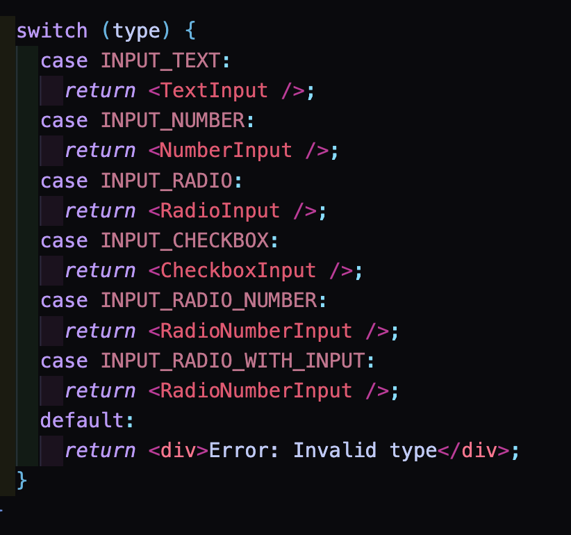

# Problems & solutions

> 기억이 희미해지기 전에 미리 되짚어보기

### 컴포넌트 동적 렌더링 하기

**문제상황**
처음에 여러개의 `Input` 컴포넌트를 만들고 이를 `type`에 맞춰 렌더 해야 했다.  
가장 쉽게 든 생각은 "아 그냥 switch문 쓰면 되잖아?" 였다.  
지금 당장 구현사항으로 주어진 `Input` 컴포넌트들은 제한적이므로 그냥 `switch`문으로 구현을 해도 별 문제가 될 것 같지 않았다.  

하지만 아무리 생각해도 재사용성(확장성)이 떨어지고, 정적 렌더링이 된다는 단점이 보였고 무엇보다 너무 장황했다.  
나중에 여러개의 Input이 추가된다면 밑도 끝도 없이 길어질 switch문...

**해결**
그래서 구글링이랑 github 레퍼런스들을 열심히 찾아봤는데 키워드는 대략 `dynamic rendering by cases(types)` 위주로 찾아봤다.  
일단 `enum`을 써야 한다는 생각은 얼추 들었는데, 초반 코드에서는 `enum`을 써도 정적이었다.  

enum을 사용하되 + `InputComponent`라는 변수를 선언해서 해당 타입에 맞는 컴포넌트를 할당 하는 방법이 가장 깔끔하고 내가 바로 채택할 수 있는 방식이었다.

이전에는 변수를 선언해서 컴포넌트를 이런식으로 할당해서 사용할 수 있는줄 몰랐는데, 꽤나 유용한 방법인 것 같다.  
이렇게 하니 `switch`를 사용하면서 코드가 장황해지지 않고, 깔끔하게 여러개의 컴포넌트를 동적으로 렌더링 할 수 있게 됐다.

---
